# PyCharm Configuration Instructions

## Overview

For this class, the PyCharm editor will be used. The following set of instructions will help you configure the editor for the various tools and run configurations that are needed. 

An important part of the configuration is setting up linters and formatters. Here is a list of links to review the various linters and formatters to be used in the class.

There are many linters and formatters to choose from in the Python programming world. For this help file, two linters and one formatter will be highlighted.

- [Autopep8](https://github.com/hhatto/autopep8) - provides code formatting
- [PyLint](https://github.com/PyCQA/pylint) - provides code linting, one of the most popular choices
- [MyPy](https://github.com/python/mypy) - provides type hinting

# PyCharm 

PyCharm from JetBrains is a popular Python code editor. It has numerous built-in code linting, formatting, and refactoring tools. Unfortunately, these tools are specific to PyCharm. For environments where each programmer uses their choice of editor, it is preferred to use external linting and formatting tools so that similar configurations can be shared across programmers while allowing them to use their preferred editor. These external linting and formatting tools are distributed as Python packages and such tools can be configured to work for all editors not just PyCharm. Unfortunately, PyCharm does not provide direct support for easily integrating many of these external linting and formatting tools. Therefore, a little extra work is required to get them up and running.

PyCharm enables the programmers to use these external linters and formatters through the configuration of external tools, file watchers, and plugins. When configured as an external tool, the linter or formatter will run when the program is executed. When configured as a file watcher, linting and formatting tools will be executed on an individual file when it is saved. Also, tools configured with a plugin will usually run when saving a file.

# Linters and Formatters for PyCharm

Here is a list of links to review how to configure various linters and formatters for PyCharm.

- Autopep8: [https://github.com/hscgavin/autopep8-on-pycharm](https://github.com/hscgavin/autopep8-on-pycharm)
- Pylint: [https://github.com/leinardi/pylint-pycharm/blob/master/README.md](https://github.com/leinardi/pylint-pycharm/blob/master/README.md)
- MyPy: [https://github.com/leinardi/mypy-pycharm/blob/master/README.md](https://github.com/leinardi/mypy-pycharm/blob/master/README.md)

Autopep8 will be configured as a file watcher. [PyLint](https://plugins.jetbrains.com/plugin/11084-pylint) and [MyPy](https://plugins.jetbrains.com/plugin/11086-mypy) will be configured using plugins created by Roberto Leinardi. Generally, using plugins is preferred to external tools, but knowing how to configure external tools and integrate their usage into a Python project is a good skill to have.

# Configure PyCharm

The following instructions assume familiarity with PyCharm for configuring and running Python projects in general.

## Installing Packages

Before configuring any editor for these linting and formatting tools, the packages for them need to be installed.

Within the desired Conda environment, run the following Conda `install` command.

If you are using Python's `venv` module, be sure to activate your virtual environment before running the following `pip` command:

```bash
python -m pip install pylint autopep8 mypy
```

If you are using Conda, be sure to activate your Conda environment before running the following `conda` command:

```bash
conda install pylint autopep8 mypy
```

## Configure File Watchers

File Watchers run when the Python code file is saved.

1. Accessing PyCharm settings on Windows and macOS is slightly different.

On Windows, File Watchers are configured under `Settings`.

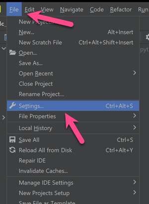

On macOS, File Watchers are configured under `Preferences`.

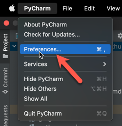

2. Search for "File Watchers" in the `Settings` search box.

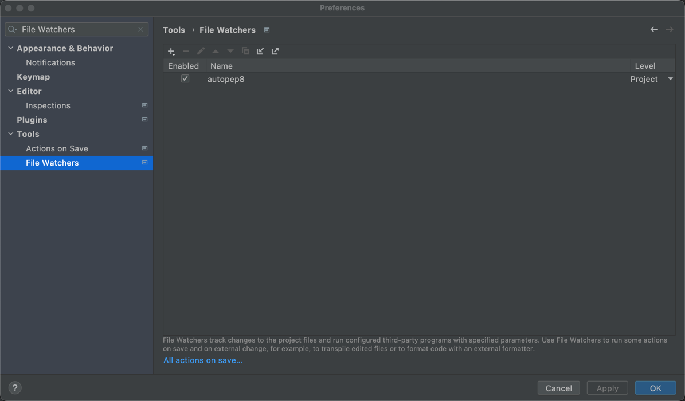

3. Click the "plus" icon to add a new Custom File Watcher.

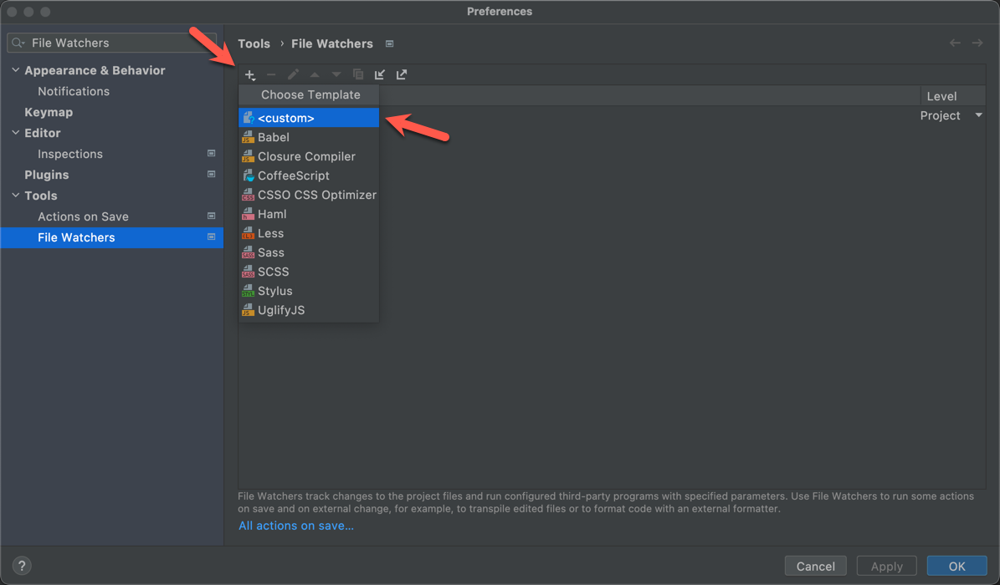

4. Add a new custom file watcher named "autopep8" configured as shown below. Update your file paths for your machine.

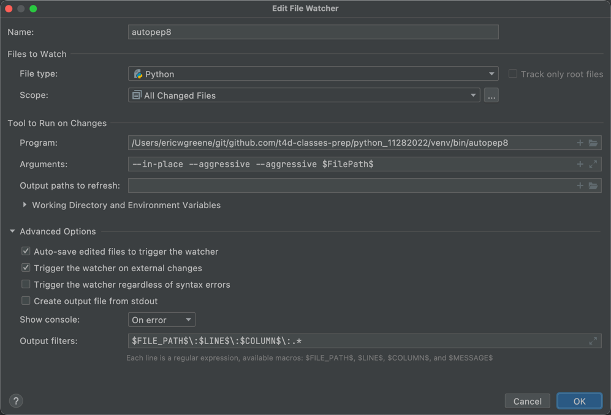

- Name: autopep8
- Files to Watch
  - Scope: All Changed Files
- Tool to Run Changes On
  - Program: <PATH TO AUTOPEP8 IN YOUR VIRTUAL ENVIRONMENT>
  - Arguments: `--in-place --aggressive --aggressive $FilePath$`
  - Working directory: `$ProjectFileDir$`
- Advanced Options
  - Auto-save edited files to trigger the watcher: Checked
  - Trigger the watcher on external changed: Checked
  - Show Console: On error
  - Output filters: `$FILE_PATH$\:$LINE$\:$COLUMN$\:.*`

## Configure PyLint Plugin

5. From the `Settings`, find the `Plugins` tool, search for "Pylint" and install the plugin authored by Roberto Leinardi.

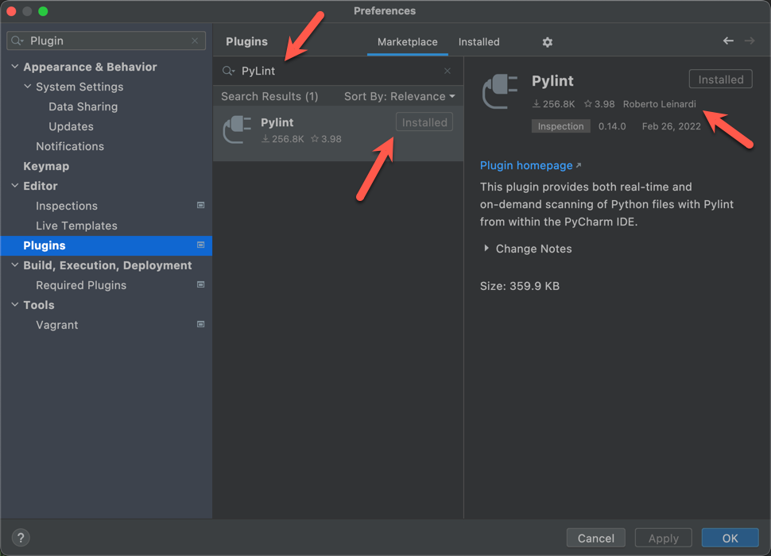

6. From the `Settings`, find the `Plugins` tool, search for "MyPy" and install the plugin authored by Roberto Leinardi. 

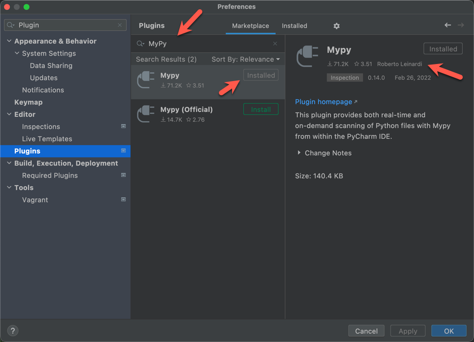

7. **IMPORTANT:** Restart PyCharm.

## Configure PyLint and MyPy Plugins

8. From the `Settings`, search for "Pylint", click on `Pylint` under `Other Settings` to configure the Pylint Plugin.

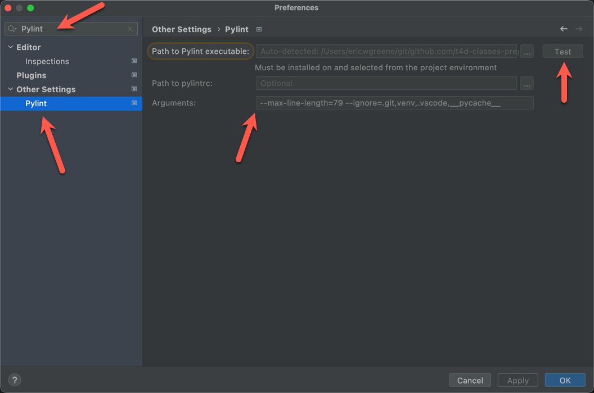

- Arguments: `--max-line-length=79 --ignore=.git,venv,.vscode,__pycache__`

9. From the `Settings`, search for "MyPy", click on `MyPy` under `Other Settings` to configure the MyPy Plugin.

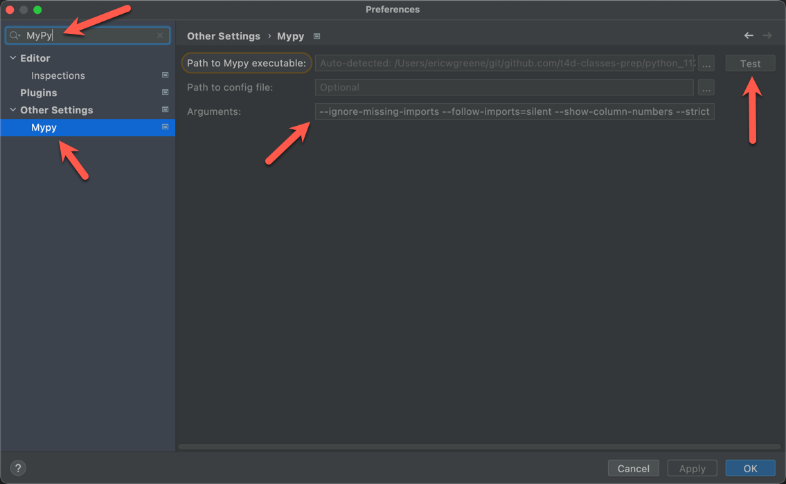

- Arguments: `--ignore-missing-imports --follow-imports=silent --show-column-numbers --strict`

## Setup Run Configuration

10. Click `Edit configurations`.

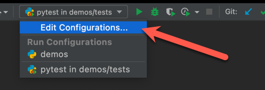

11. Click the "+" plus sign to create a new `Python` run configuration.

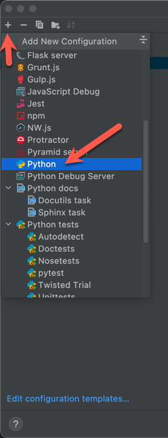

12. Enter the following configuration values.

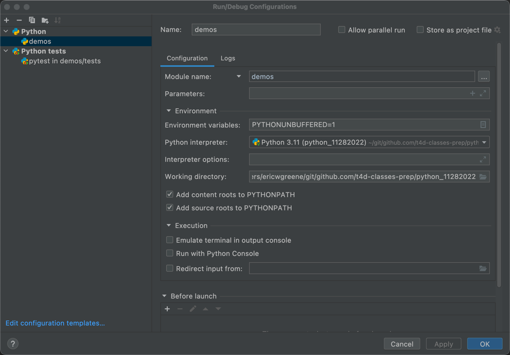

- Name: `demos`
- Change Target from `Script path` to `Module name`
- Python interpreter: Change to the `python` executable for the virtual environment
- Working Directory: Set the path to the project folder
